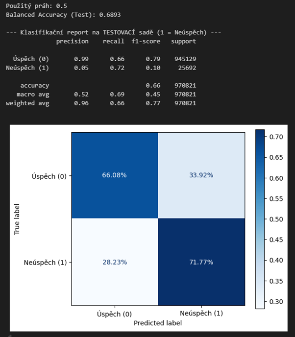
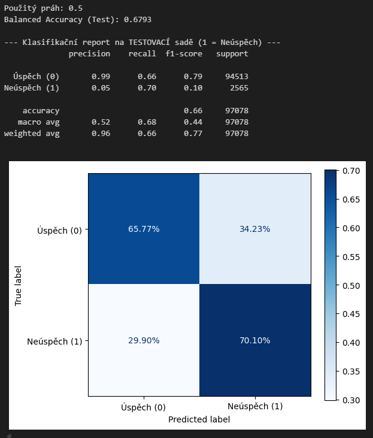
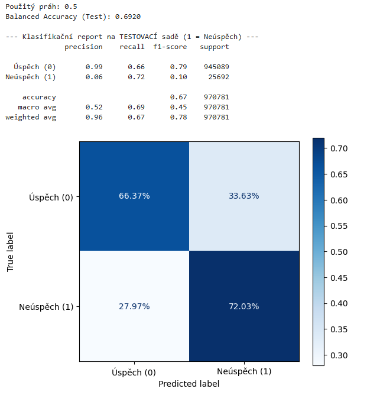
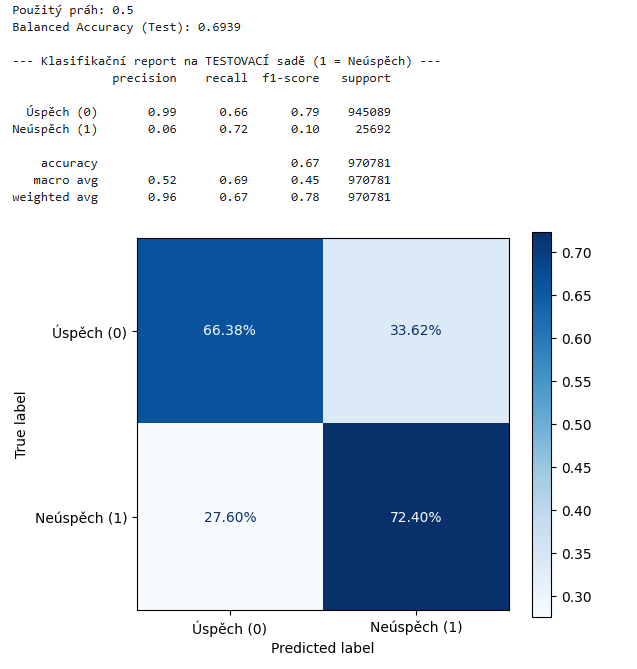
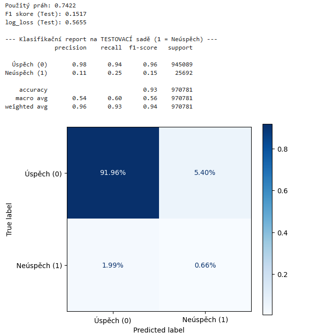

# CLEAN MODEL
Dosažený Logloss: 0.5877 v iteraci 1883  
Nejlepší parametry: {'learning_rate': 0.03, 'l2_leaf_reg': 3, 'depth': 8}  

# RAW MODEL 10%
Dosažený Logloss: 0.6060 v iteraci 382  
Nejlepší parametry: {'learning_rate': 0.03, 'l2_leaf_reg': 3, 'depth': 8}  

# RAW MODEL vast.ai  
Dosažený Logloss: 0.5835 v iteraci 2157  
Nejlepší parametry: {'learning_rate': 0.03, 'l2_leaf_reg': 3, 'depth': 8}  

# CLEN MODEL vast.ai  
Dosažený Logloss: 0.5830 v iteraci 1664  
Nejlepší parametry: {'learning_rate': 0.03, 'l2_leaf_reg': 3, 'depth': 8}  

# RAW MODEL bez limitu komplexity 1 na vast.ai
Dosažený Logloss: 0.5794 v iteraci 3058  
Nejlepší parametry: {'learning_rate': 0.03, 'l2_leaf_reg': 3, 'depth': 8}  
F1 skore (Test): 0.1517  
